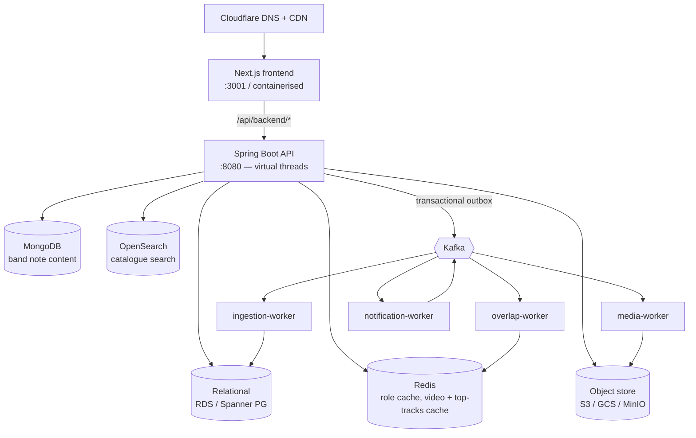

# System walkthrough

How the cloud-agnostic version fits together, in the order a request touches it.

## The shape

## 1. Sign in

1. Frontend redirects to the IdP (`FederatedIdentityProvider.authorizationUrl`).
   Cognito on AWS, Identity Platform on GCP — same interface (ADR 0009 pattern).
2. IdP federates to Google/Facebook/Spotify, returns a normalised
   `ProviderIdentity(provider, sub, email, emailVerified)`.
3. `IdentityLinkingService.resolveOnSignIn`:
   - known `(provider, sub)` → that user;
   - unknown → **new** user + identity. Never matched on email (ADR 0002, 0003).
4. The API mints its **own** session token: claims `user_id`, `is_staff`, and
   nothing band-scoped (ADR 0004). The provider token stops here — it never
   reaches the domain layer (PRD §3.2), which is what makes the cloud swap
   survivable.

## 2. Connect Spotify

Separate from sign-in. Authenticated user authorises Spotify; the API stores the
**refresh token in the secret store** (`SecretStore.put` → Secrets Manager /
Secret Manager) and keeps only the returned reference in `spotify_links`
(V1 migration). Then it publishes `catalogue.ingest.requested`.

## 3. Ingestion (async)

`ingestion-worker` consumes `catalogue.ingest.requested`, pulls
`GET /me/top/tracks`, respects Spotify's rate limits with backoff, upserts
`songs` + `song_sources` (ISRC match where present, ADR 0013), and caches the
raw response in Redis with the salvaged TTLs (24h / 3d / 7d, [SALVAGE.md](./SALVAGE.md)).

## 4. Liking a song and the band pool

- A like is **synchronous** — a thumbs-up must feel instant. Row written with a
  unique `(user, song)` constraint. An analytics event goes to Kafka
  *alongside*, never on the write path (PRD §3.1).
- The band pool is a **read-time query** (`band_pool_v`, V10): distinct likers
  among current members ≥ `overlap_threshold`, excluding songs with a pending
  cross-provider match prompt (ADR 0007, 0013).
- On a membership or threshold change the API publishes
  `band.overlap.invalidated`; `overlap-worker` busts the Redis pool cache and
  raises notifications. It does **not** rebuild a stored pool — there isn't one.

## 5. Cross-provider matching

A pasted YouTube link (`videos.list`, 1 quota unit — no search, ADR 0010) is
scored against existing songs by `SongMatcher`:

- ISRC equal → same song, exact.
- trigram score ≥ 0.85 → same song; 0.60–0.85 → `song_match_prompts` row, user
  is asked, song stays out of the pool until confirmed; < 0.60 → separate song.

## 6. Recording feedback

- Client uploads straight to object storage via a presigned URL
  (`ObjectStore.presignedUpload`). Claim-check (ADR 0017): only the object key
  goes into `media.uploaded`, never bytes — Kafka's 1 MB message cap makes the
  alternative a non-starter.
- `media-worker` transcodes, thumbnails, probes duration, writes derived objects
  back, updates the `recordings` row. Media is uncapped in this version
  (ADR 0012); egress is watched, not limited.

## 7. Erasure (GDPR)

Account deletion is **application code**, not `ON DELETE CASCADE` (ADR 0009):
delete/anonymise relational rows, MongoDB note documents (author → "Former
member", ADR 0014), and objects in storage. Kafka needs no cleanup because
payloads carry user IDs only, never personal data (PRD §10) — the log is
erasure-neutral by construction.

---

## Ordered backlog

| # | Slice | Unlocks |
|---|---|---|
| 1 | JPA entities + repositories for `identity`; wire `IdentityLinkingService` to them | Real sign-in; ADR 0003 integration test |
| 2 | Session token: mint on sign-in, decode filter; `SecurityConfig` → `.authenticated()` | Every other authenticated endpoint |
| 3 | `BandRoleResolver` impl (Postgres + Redis, explicit invalidation) | Band-scoped authorisation (ADR 0004) |
| 4 | REST: create band, join flow, like, pool read (`band_pool_v`) | The core loop, end to end |
| 5 | Transactional outbox relay; first real producer + `overlap-worker` consumer | Event backbone proven |
| 6 | Spotify client (port from SALVAGE.md) + `ingestion-worker` body | Top tracks populate |
| 7 | Presigned upload + `media.uploaded` + `media-worker` ffmpeg | Recordings |
| 8 | `platform.aws` implementations; Terraform `envs/aws` | First real deploy |
| 9 | `platform.gcp` + `envs/gcp`; the migration runbook | The portability claim, tested |
