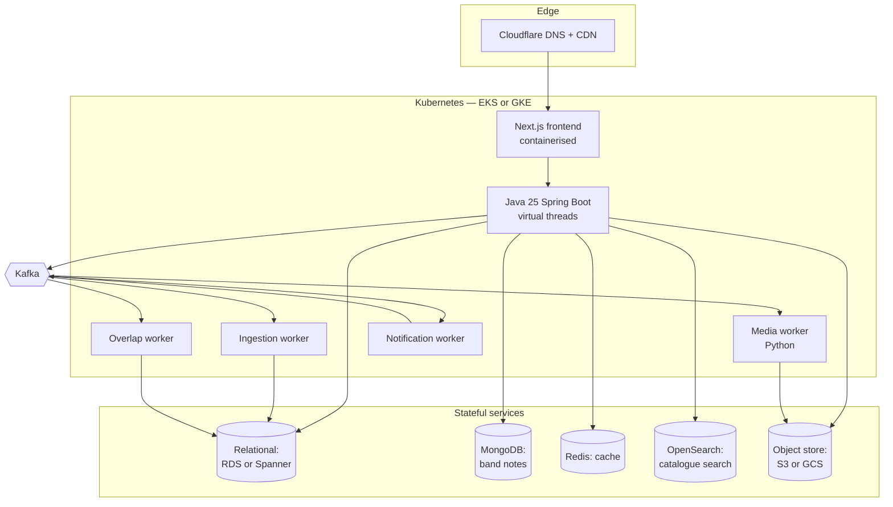
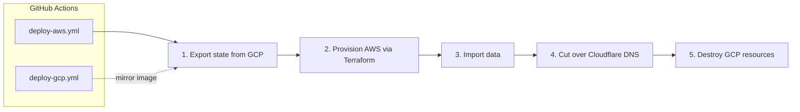

# Learn Our Favs — Demonstration Architecture PRD

**Author:** James Twisleton
**Version:** 0.1 (draft — open decisions were marked ⬥; all are now closed, see §13 and `adr/`)
**Status:** Specification. Foundation under construction in this folder.

---

## What this document is

This is the **deliberately over-engineered** specification for Learn Our Favs.

The product described here could be built by one person in a fortnight using Next.js and Supabase. That version is specified separately in `../../lean/learn-our-favs-prd-lean.md`, and it is the version intended for real users.

This version exists to exercise a specific set of engineering practices end to end — dual-cloud infrastructure-as-code, event-driven services, federated identity, orchestration, observability. Where a choice here is heavier than the problem demands, that is stated plainly rather than justified after the fact. **The tradeoff register at the end is the honest accounting.**

A reader who wants the short version: sections 1–3 describe the product; section 12 describes what I would actually do.

---

## Product, domain model, and flows

The product, domain model, and two flows (band pool overlap and identity linking) are shared across both versions and documented in [`docs/PRODUCT.md`](../../docs/PRODUCT.md). Read that first; this document describes the demonstration-specific architecture and choices.

---

## 4. Roles and permissions

Two scopes that must never share a flag.

| Scope | Roles | Can do |
|---|---|---|
| **Band** | `owner`, `admin`, `member` | Set overlap threshold, accept/refuse join requests, promote and demote within *their own band* |
| **Platform** | `is_staff` | Admin portal: view, edit, delete any user or band |

Conflating these produces a privilege-escalation bug in which a band owner can delete other people's bands. They are enforced by separate checks against separate claims. (ADR 0005.)

**Floor rules**

- An owner cannot demote themselves while they are the only admin.
- When an owner leaves, the **longest-serving remaining member** is promoted automatically (hence `joined_at` on membership).
- A band is never left without an owner.

**Pre-join visibility.** A signed-in non-member visiting `/b/silly-little-otter` sees the band name, member count, and members' instruments. They do **not** see the song pool, notes, or recordings. This is an authorisation boundary, not a UI preference.

**Slugs** are generated server-side in Spring Boot from a curated safe word list — profanity-filtered at generation, unique constraint with retry-on-conflict. Client-side generation cannot enforce uniqueness, and a random word generator will eventually produce something embarrassing in a live demo. (ADR 0008.)

---

## 5. Song matching across providers

Cross-provider matching is genuinely hard and is the source of most product-level ambiguity.

| Case | Approach |
|---|---|
| Spotify → Spotify | **ISRC**, available free in standard track metadata. Exact. |
| Spotify → YouTube | Fuzzy match. Title and artist both present in the YouTube title, after case/punctuation normalisation and stripping noise tokens (`official video`, `lyrics`, `ft.`, `remastered`). |
| Ambiguous | User-facing prompt: *"Your bandmate likes this — is it the same song?"* |

A song pending confirmation does **not** enter the pool. Similarity thresholds are closed: auto-accept at ≥ 0.85, prompt in 0.60–0.85, reject below 0.60, on a normalised trigram similarity over `title + artist`. (ADR 0013.)

**YouTube quota is a hard design constraint, not a detail.** The Data API's default free allowance is 10,000 units/day; a single `search` call costs 100 units — roughly 100 searches per day across *all* users. A `videos.list` lookup by ID costs 1.

Therefore v1 ships **YouTube link-paste only — no API search at all** (ADR 0010). Pasting a YouTube link is the primary call to action; `videos.list` by ID (1 unit) resolves metadata; results are cached in Redis by video ID.

---

## 6. Architecture

### Component decisions

Each row states what the component demonstrates and — honestly — whether the product needs it.

| Component | Choice | Demonstrates | Does the product need it? |
|---|---|---|---|
| Frontend | Next.js + Storybook | Component-driven development | Yes. Storybook is justified by a real shared component library. |
| Backend | Java 25 Spring Boot, virtual threads | High concurrency without reactive complexity | Java, yes. Virtual threads are showcase — load is nowhere near needing them. |
| Orchestration | Kubernetes (EKS/GKE) | Container orchestration, portability | **No.** Cloud Run or ECS Fargate would do this comfortably. Kubernetes is here to exercise it. |
| Relational | RDS (AWS) / Spanner (GCP) | Portable schema design | RDS yes. Spanner is showcase — see §7. |
| Documents | MongoDB | Document modelling | Reasonable. Band notes are rich, semi-structured, versioned — a genuinely better fit than a relational blob. |
| Cache | Redis | Caching strategy, rate limiting | Yes. Role lookups, video metadata, upstream API responses. |
| Search | OpenSearch | Full-text search at scale | Overkill for catalogue search, which could proxy to Spotify. Justified as the "add any song" experience. |
| Events | Kafka | Event-driven architecture | Partly. Media post-processing genuinely needs a queue; the rest could be simpler. |
| Media worker | Python | Transcoding pipeline | Yes — the right language for ffmpeg orchestration. |

---

## 7. Cloud portability

The claim under test: **the same application runs on AWS or GCP, provisioned by Terraform, with one shared domain.**

**Provider abstraction.** Cloud-specific DTOs sit behind provider-agnostic interfaces — identity, object storage, secrets. The active implementation is selected by configuration, and that configuration is set by Terraform. The discipline that makes this real rather than decorative: **no provider-specific claim, key format, or error type may leak into the domain layer.** An abstraction that only truly works on AWS is worse than no abstraction, because it hides the coupling.

**Data continuity.** The migration is a genuine export → provision → import → cut over → destroy sequence, with downtime during DNS propagation. Naively running `terraform destroy` would take every user's bands, notes, and recordings with it. Getting this right is the point of the exercise.

**Two honest caveats:**

1. **RDS and Spanner are not drop-in swappable.** Spanner's PostgreSQL interface is not full PostgreSQL — different DDL, different transaction semantics, constrained foreign keys. Keeping one schema and one query set genuinely compatible with both is real work and real constraint. SQL is written to the intersection of both dialects.
2. **Cognito and GCP Identity Platform differ** in token format and user pool model. "One account, many providers" is implemented twice behind one interface.

**Closed decision:** state stays **inside both clouds** — RDS on AWS, Spanner on GCP — keeping the dialect-compatibility demonstration rather than moving state to Neon/R2. (ADR 0009.)

---

## 8. Events

Four topics. Each earns its place by being slow, spiky, retry-worthy, or fan-out shaped.

| Topic | Trigger | Consumer does | Why async |
|---|---|---|---|
| `media.uploaded` | Upload completes | Transcode, thumbnail, extract duration | Slow, CPU-heavy, spiky, must survive retry |
| `catalogue.ingest.requested` | User connects provider or refreshes | Pull top tracks, respect upstream rate limits | Rate-limited upstream, needs backoff |
| `band.overlap.invalidated` | Membership or threshold change | Recompute affected pools | Fan-out, tolerates lag |
| `notification.raised` | Join request, comment, new recording | Deliver notification | Classic decoupled consumer |

**Claim-check pattern for media.** Files upload directly to object storage; the event carries only the object key and metadata. Kafka's default maximum message size is 1 MB — pushing video bytes through a log broker is a well-known anti-pattern and would fail immediately at real file sizes. (ADR 0017.)

**Why Kafka rather than SNS/SQS or Pub/Sub:** it is the one broker that runs identically on both clouds, which is precisely the portability thesis. Managed alternatives would be cheaper and easier on either cloud alone. (ADR 0018.)

**Personal data stays out of event payloads.** Events reference user IDs. This is not tidiness — see §10.

---

## 9. Delivery pipeline

**PR previews: ephemeral compute, shared state.** Each pull request gets its own frontend and backend container, fully usable and shareable — a reviewer can click through the actual change. Databases, Kafka, and object storage are shared across the dev environment rather than provisioned per branch, because standing up a full stateful stack per PR is disproportionate.

Two consequences that must be designed for, not discovered:

- **Migrations must be backwards-compatible.** A shared database means a schema change in one PR can break every other open preview simultaneously.
- **Kafka topics and consumer groups are prefixed by branch in non-production.** Otherwise two previews consume the same topic and steal each other's messages.

**Testing.** TDD throughout. Testcontainers for integration tests against real dependencies. Contract testing between services. Smoke tests run against the deployed preview, not a mock. OWASP checks in the pipeline.

---

## 10. Observability, cost, and data protection

### Runtime

Centralised logging to CloudWatch or Google Cloud Logging, with Datadog for cross-cloud dashboards and alerting. Resources are tagged by feature so spend is attributable — **video egress is expected to dominate** and needs to be visible separately from everything else, since egress is what makes media features expensive rather than storage.

**Closed decision:** media ships **uncapped, with cost monitoring** — no duration cap, no audio-only mode. Datadog egress dashboards and billing alerts are the control. This is the one deliberate divergence from the lean version, which ships audio-only. (ADR 0012.)

### Build-time LLM cost

Unusual to specify, and deliberately included. This project is built with AI assistance, and that spend is tracked as a first-class metric:

- **Model tiering by task.** High-capability models for architecture, specification, and non-obvious debugging. Cheap models for boilerplate, test scaffolding, and mechanical refactors.
- **Running tally** by task category, in GBP.
- **Upfront estimate** before implementation, compared against actuals afterwards.

Estimates are in ADR 0016 and tracked in `docs/llm-cost-log.md`.

| Phase | Model tier | Est. cost (GBP) | Actual |
|---|---|---|---|
| Specification | High | 25 | — |
| Scaffolding | Low | 15 | — |
| Feature implementation | Mixed | 140 | — |
| Test authoring | Low | 40 | — |
| Debugging | High | 60 | — |
| **Total** | | **280** | — |

**Cognitive ownership.** Every architectural and granular decision — code style, naming, error handling, module boundaries — is made by me, not delegated. AI accelerates typing, not judgement. Any code I cannot explain in an interview does not ship.

### Data protection

UK GDPR sets **no fixed retention period**. Periods are defined per data type and justified against purpose, then documented. Data no longer needed for its stated purpose is deleted or anonymised.

| Data | Retention |
|---|---|
| Account and identities | Life of account |
| Spotify refresh tokens | Life of link; revoked on unlink |
| Recordings and media | Life of account, or until deleted by uploader |
| Band notes | Life of band. On member departure: content kept, author relabelled "Former member" (ADR 0014). |
| Logs and telemetry | Application logs 30 days; audit/security logs 90 days (ADR 0015). |

**Erasure must reach everywhere, including backups.** Practically, that means:

- Relational rows and MongoDB documents deleted or anonymised.
- Objects removed from S3/GCS — recordings and avatars are personal data.
- **Kafka is the awkward one.** Topics retain messages independently of the database, so an erasure request would leave personal data sitting in the log. This is why events carry user IDs and never personal data — it makes the log erasure-neutral by construction.

**ISO 27001:** the system is *designed with a view to being certifiable* — access control, encryption at rest and in transit, audit logging, documented retention. It is not certified, and a solo project cannot be. The distinction is worth stating accurately.

---

## 11. Documentation plan

Documentation is a deliverable, not an afterthought.

| Artefact | Audience | Register |
|---|---|---|
| Help section | End users | **ASD-STE100** |
| Code documentation | Contributing developers | **ASD-STE100** |
| API reference (OpenAPI) | Contributing developers | **ASD-STE100** |
| Architecture decision records | Reviewers, interviewers | Normal prose |
| This PRD | Reviewers, interviewers | Normal prose |

**ASD-STE100** (Simplified Technical English) is a controlled language from aerospace maintenance documentation: restricted vocabulary, one meaning per word, short sentences, active voice. It makes instructional content readable regardless of the reader's English level.

It is applied to instructional and reference material only. Architectural rationale stays in normal prose, because controlled vocabulary flattens exactly the nuance that makes a tradeoff discussion worth reading.

**Code documentation means documentation** — module-level explanations of *why*, ADRs for significant choices, a README that gets a new developer running locally. Not a comment on every line.

**Minimal code is a requirement.** AI-assisted development tends toward volume. Fewer lines are easier for a human to review, and reviewability is the constraint that matters here.

---

## 12. Tradeoff register

The honest accounting. If asked *"isn't this over-engineered?"* — yes, and here is the version I would actually build.

| Decision | Demonstration version | What I would ship | Why the difference |
|---|---|---|---|
| Compute | Kubernetes, dual-cloud | Vercel + one managed container | Kubernetes solves a scale problem this app does not have |
| Database | RDS + Spanner, dialect-compatible | Managed Postgres | Spanner is planet-scale infrastructure for a hobby app |
| Events | Kafka, four topics | One background queue for media | Only media post-processing genuinely needs async |
| Notes storage | MongoDB | JSONB column | A second datastore for one feature is rarely worth the operational cost |
| Search | OpenSearch | Proxy Spotify's search | Nobody needs a search cluster to find a song |
| Identity | Cognito/Identity Platform + own token | Managed auth with social providers | The linking rules matter; the infrastructure does not |
| Previews | Per-PR containers | Vercel preview deployments | Same outcome, none of the work |

**What survives in both versions** — because these are product and safety decisions rather than infrastructure fashion:

- Identities keyed on `(provider, provider_user_id)`, never email.
- No auto-linking. Linking only from an authenticated session.
- Band roles resolved per request, never baked into a token.
- Band-scope and platform-scope permissions separated.
- Learning state per (user, song, instrument).
- Users paste their own reference material; the app hosts no notation.
- Personal data never in event payloads.

---

## 13. Open decisions — all closed

Every ⬥ from draft 0.1 now has an ADR. Closing them was the point.

| # | Decision | Resolution | ADR |
|---|---|---|---|
| 1 | Similarity threshold for the "is this the same song?" prompt | Auto ≥ 0.85, prompt 0.60–0.85, reject < 0.60 (normalised trigram similarity on title + artist) | 0013 |
| 2 | Difficulty rubric — parked or user-rated? | User-rated in v1, aggregated on read | 0011 |
| 3 | State inside both clouds or outside both? | Inside both — RDS + Spanner, dialect-compatible SQL | 0009 |
| 4 | Media scope — cap, audio-only, or uncapped? | Uncapped with cost monitoring (the one divergence from lean) | 0012 |
| 5 | Note authorship when a member leaves | Keep content, relabel author "Former member" | 0014 |
| 6 | Log and telemetry retention | App logs 30 days; audit/security logs 90 days | 0015 |
| 7 | LLM build-cost estimates per phase | Estimated (£280 total); tracked in `llm-cost-log.md` | 0016 |
| 8 | Does YouTube ship in v1? | Yes, link-paste only — no API search | 0010 |
