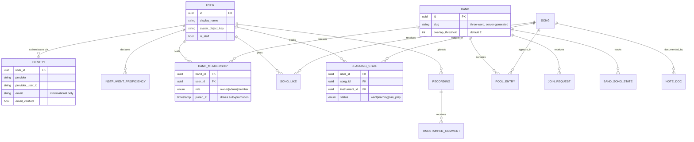
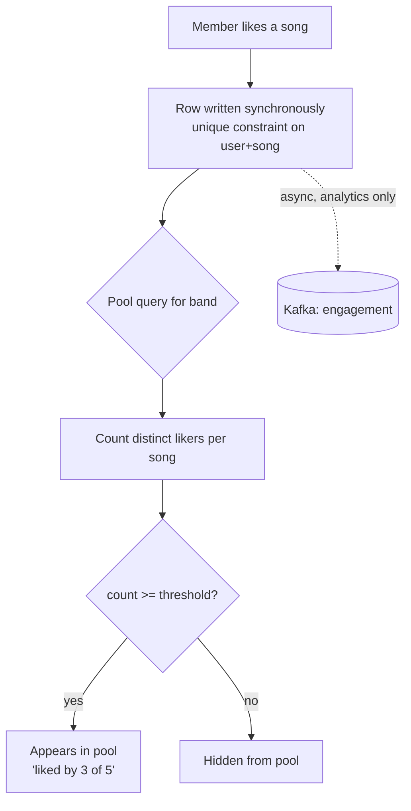
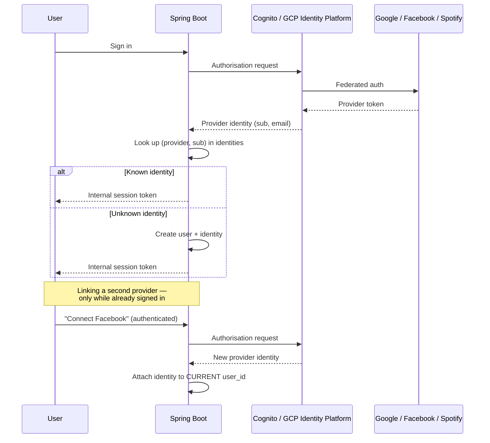

# Learn Our Favs — Product specification

Musicians rarely learn the songs they most want to play, because working out *which* of their favourites is achievable — and finding someone to play it with — is tedious.

Learn Our Favs connects to a listening account, pulls the user's most-played tracks, and lets them form small groups ("bands") around songs that more than one member already loves.

## Core loop

1. Sign in. Connect Spotify (and optionally YouTube).
2. Declare which instruments you play.
3. See your most-played tracks.
4. Create or join a band via an invite link.
5. The band's shared pool surfaces songs multiple members like.
6. Add notes, track learning progress, record yourself playing, get feedback.

## Explicitly out of scope for v1

- **Automatic (algorithmic) difficulty rating.** There is no reliable signal for "how hard is this on guitar" in any available API, and a bad rubric is worse than none. v1 instead ships **user-submitted difficulty ratings, aggregated** — see [ADR 0011](../cloud-agnostic/docs/adr/0011-user-rated-difficulty.md). Original ⬥ now closed.
- **Hosting tabs or sheet music.** The app never fetches or redisplays copyrighted notation. Users paste their own reference material into band notes, which places the app in the same position as any document host. This is a genuine mitigation, not a loophole — residual risk is accepted at this scale and revisited if the app grows.

---

## Domain model

**Two model decisions worth defending in a room:**

- `LEARNING_STATE` is keyed on **(user, song, instrument)**. Someone can play a song on piano and be learning it on guitar. A `songs.difficulty` column would have been simpler and wrong. ([ADR 0006](../cloud-agnostic/docs/adr/0006-learning-state-per-user-song-instrument.md).)
- `IDENTITY` is unique on **(provider, provider_user_id)** — the OIDC `sub` — never on email. Email is mutable at the provider, sometimes absent (Apple relay addresses, phone-registered accounts), and attacker-controllable. It is stored for display and never matched on. ([ADR 0002](../cloud-agnostic/docs/adr/0002-identity-keyed-on-provider-sub.md).)

---

## Two flows that carry the product

### Band pool overlap

A song enters a band's pool when it is liked by at least `overlap_threshold` members (default 2). Members may also add any song manually — from their own top tracks or by catalogue search — and adding counts as a like from that person. One unified thumbs-up action, one code path, regardless of how a song arrived.

The threshold is settable by the band owner. **Overlap is computed on read, not stored.** When membership or threshold changes, the pool re-evaluates immediately and songs may drop out. This is visible to every member and is intended. ([ADR 0007](../cloud-agnostic/docs/adr/0007-overlap-computed-on-read.md).)

Likes are written synchronously. They do **not** flow through Kafka on the write path — a thumbs-up must feel instant, and eventual consistency on a UI toggle is a bug, not an architecture. An analytics stream is fed asynchronously alongside.

### Identity linking

One account, many providers. Sign in with Google today, Facebook tomorrow, both reaching the same user.

**The rule that matters: identities are never auto-linked by email.** Linking happens only from an authenticated session. Without this, an attacker registers a Facebook account carrying a victim's email address, signs in, and is silently attached to the victim's account — bands, notes, linked Spotify tokens and all. No password required. A uniqueness constraint does not prevent this, because the two rows are legitimately distinct; the vulnerability lives in the linking decision, which is application logic. ([ADR 0003](../cloud-agnostic/docs/adr/0003-no-auto-linking-by-email.md).)

**Claims.** The IdP authenticates; the application mints its own session token carrying its own claim set (`user_id`, `is_staff`). Provider tokens never reach the domain layer. This is what makes the cloud swap survivable — the app's notion of identity does not change when the identity provider does.

**Band roles are deliberately excluded from the token.** Membership is dynamic: people join, get promoted, leave. A role baked into a JWT is stale the moment anything changes and cannot be revoked before expiry. Roles are resolved per request from the database, cached in Redis. Stable identity in the token; volatile authorisation out of it. ([ADR 0004](../cloud-agnostic/docs/adr/0004-band-roles-resolved-per-request.md).)

**Spotify refresh tokens** are stored per user regardless of sign-in provider, because top-tracks calls need them. Encrypted at rest via Secrets Manager / Secret Manager — never a plain column.
