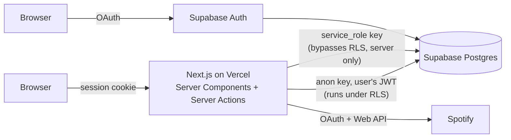

# Lean architecture — one page

## The whole system

There is no separate backend. Next.js **is** the backend: Server Components read
data, Server Actions write it, both talking straight to Postgres.

## Two ways the app talks to the database

| Client | Key | Runs under RLS? | Used for |
|---|---|---|---|
| `createClient()` (server) | anon + the signed-in user's JWT | **Yes** | Almost everything. RLS policies decide what the user can see and do. |
| `createClient()` (browser) | anon + JWT | Yes | Only sign-in (`supabase.auth.signInWithOAuth`). |
| `createAdminClient()` | `service_role` | **No — full access** | Exactly two things: reading/writing Spotify refresh tokens, and that's it. Never imported into a component. |

The security model is: **the database enforces authorisation, not the app.**
See [`docs/AUTHORISATION.md`](./AUTHORISATION.md).

## Where each concept from the PRD lives

| PRD idea | Lean implementation |
|---|---|
| Identity keyed on `(provider, sub)`, never email (ADR 0002) | Supabase Auth's `auth.identities`. Our tables key on `auth.users.id`. |
| No auto-linking (ADR 0003) | `enable_manual_linking = true` in `config.toml` + a project setting — see [KNOWN-LIMITATIONS](./KNOWN-LIMITATIONS.md). |
| Band roles resolved per request (ADR 0004) | RLS policies call `band_role(band)` / `is_band_member(band)` on every query. Nothing is cached in the JWT. |
| Band vs platform scope (ADR 0005) | `band_memberships.role` vs `profiles.is_staff`. Different columns, different policies. |
| Learning state per (user, song, instrument) (ADR 0006) | `difficulty_ratings` and (future) a learning-state table share that 3-column key. |
| Overlap computed on read (ADR 0007) | `band_pool(band)` — a function that aggregates likes live. No stored pool table. |
| Server-side slugs (ADR 0008) | `generate_band_slug()` — adjective-adjective-animal, retry on conflict. |
| Pre-join visibility (PRD §4) | `band_public_summary()` + `band_instruments()` — security-definer, expose only name / count / instrument set. |
| Difficulty is user-rated (ADR 0011) | `difficulty_ratings`, aggregated in the UI. No algorithmic score. |
| Cross-provider matching (ADR 0013) | `src/lib/matching.ts` — normalise + trigram, same thresholds as the cloud-agnostic backend. |
| Note authorship on departure (ADR 0014) | `band_notes.updated_by` nulled, `updated_by_label` set to "Former member". |

## What is deliberately missing (vs the cloud-agnostic version)

Kubernetes, Terraform, Kafka, Spanner, MongoDB, OpenSearch, a separate Java
service, Datadog. Each is replaced by a Supabase or Vercel primitive, or by
nothing. The reasoning is in `learn-my-faves-prd-lean.md` → "What is dropped".
