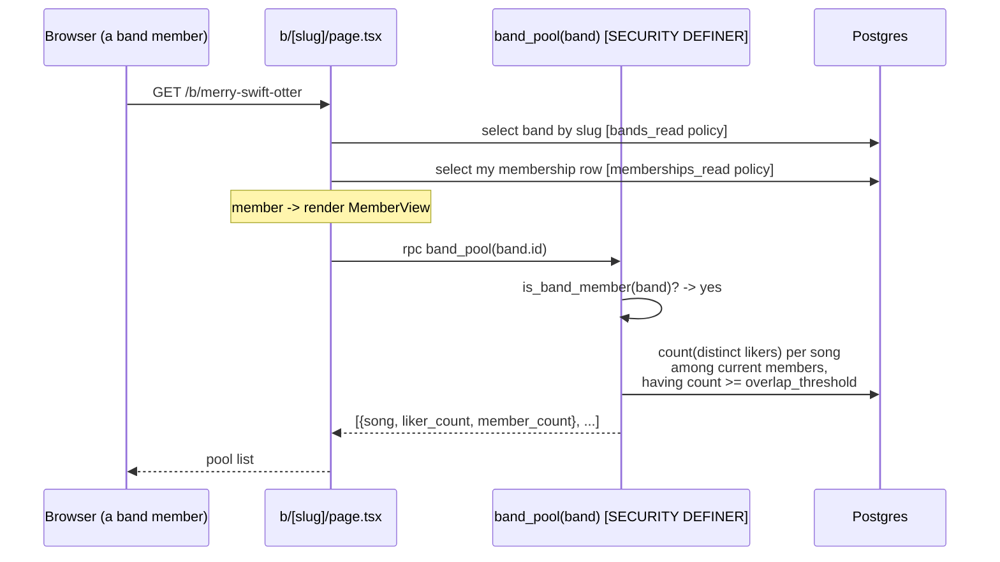

# How a request flows — two worked examples

## A. Liking a song from the dashboard

```mermaid
sequenceDiagram
    participant U as Browser
    participant MW as middleware.ts
    participant P as dashboard/page.tsx (Server Component)
    participant A as dashboard/actions.ts (Server Action)
    participant DB as Postgres (RLS)

    U->>MW: GET /dashboard
    MW->>MW: refresh Supabase session cookie
    MW->>P: (continue)
    P->>DB: select profile, instruments, proficiency, likes  [as user, RLS]
    P->>DB: (server) read spotify refresh token  [service_role]
    P->>Spotify: refresh token -> access token -> GET /me/top/tracks
    P-->>U: rendered list, each row a <form action={toggleLike}>

    U->>A: submit toggleLike (song not yet liked)
    A->>DB: select songs where spotify_track_id = ?   [as user]
    A->>DB: insert into songs (...)                   [as user, songs_insert policy]
    A->>DB: upsert song_likes (user_id = auth.uid())  [likes_write_own policy]
    A->>A: revalidatePath('/dashboard')
    A-->>U: page re-renders, row now shows "♥ Liked"
```

Key points:

- The Server Component and Server Action both use `createClient()` (server) —
  every query runs as the signed-in user, under RLS.
- `song_likes` insert only succeeds because the policy checks
  `user_id = auth.uid()`. The app *also* sets it, but the database is the
  gate.
- The Spotify refresh token read is the one place `service_role` is used, and
  it happens server-side only.

## B. The band pool ("liked by 3 of 5")

Key points:

- The pool is **computed on read** (ADR 0007). There is no `pool` table to keep
  in sync. Change the threshold or remove a member and the next page load
  reflects it.
- `band_pool` is `SECURITY DEFINER` so it can aggregate across all members'
  likes, but its first line is `if not is_band_member(band) then raise` — a
  non-member calling it gets an error, not data.
- A non-member hitting the same page gets `NonMemberView` instead: name, count,
  instruments, and a "request to join" button.
