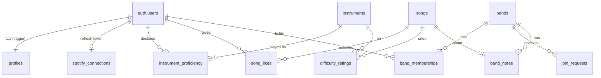

# The lean schema, annotated

Three migrations, applied in order by `supabase start` / `supabase db reset`:

| File | What |
|---|---|
| `20260905000100_schema.sql` | Tables |
| `20260905000200_functions.sql` | Functions + triggers (slug gen, pool, succession, pre-join views) |
| `20260905000300_rls.sql` | Row-level security policies — the authorisation model |

Portability: native `uuid` with `gen_random_uuid()` defaults, `timestamptz`
everywhere, and `text` + `CHECK` for enumerations (not Postgres `enum` types) so
the schema moves to plain RDS unchanged (lean PRD "Migration path").

## Entity map

## Table-by-table

### `profiles`
Mirror of `auth.users`, created by the `on_auth_user_created` trigger. Holds
`display_name`, `avatar_url`, and `is_staff` — the **platform** scope flag
(ADR 0005), entirely separate from band roles.

### `spotify_connections`
`user_id` → `refresh_token`. In the `public` schema so PostgREST can reach it,
but **RLS is on with no client policy** → only `service_role` (server code)
touches it. See [SPOTIFY-AUTH](./SPOTIFY-AUTH.md).

### `instruments`, `instrument_proficiency`
Reference list (seeded) + per-user `(user, instrument) → skill_level`. Carried
over from the prototype ([`../../cloud-agnostic/docs/SALVAGE.md`](../../cloud-agnostic/docs/SALVAGE.md)).

### `songs`
Canonical song. `spotify_track_id`, `youtube_video_id`, and `isrc` are each
`unique` (nulls allowed). Cross-provider matching ([`src/lib/matching.ts`](../src/lib/matching.ts),
ADR 0013) decides whether a new provider reference is the same `songs` row.

### `song_likes`
`unique (user_id, song_id)` — one thumbs-up per person per song, however the
song arrived (ADR 0007). The band pool counts *distinct likers among current
members*; the like itself is global, not per band.

### `difficulty_ratings`
`unique (user_id, song_id, instrument_id)`, `rating` 1–5. User-submitted,
aggregated on read (ADR 0011). There is deliberately **no** `songs.difficulty`
column.

### `bands`
`slug` is `unique` and server-generated (`generate_band_slug()`, ADR 0008).
`overlap_threshold` defaults to 2.

### `band_memberships`
`role` is `owner | admin | member`, checked per request by RLS (ADR 0004) —
never in a token. `joined_at` drives owner succession.

### `join_requests`
`pending → accepted | refused | withdrawn`. Band admins decide (RLS policy
`joinreq_decide`).

### `band_notes`
`body jsonb` — a column, not a second datastore ([lean PRD](../learn-our-favs-prd-lean.md) "what is dropped").
`updated_by` / `updated_by_label`: on member departure the user id is nulled and
the label set to "Former member" ([ADR 0014](../../cloud-agnostic/docs/adr/0014-note-authorship-on-member-departure.md)).

## Functions worth knowing

| Function | Purpose | Security |
|---|---|---|
| `is_band_member(band)` / `band_role(band)` | RLS building blocks | DEFINER |
| `generate_band_slug()` | adjective-adjective-animal, retry on conflict | DEFINER |
| `create_band(name)` | insert band + owner membership atomically | DEFINER |
| `band_pool(band)` | the pool, computed on read; refuses non-members | DEFINER, STABLE |
| `band_public_summary(band)` / `band_instruments(band)` | pre-join visibility only | DEFINER, STABLE |
| `handle_membership_removed()` | owner succession trigger | DEFINER |
| `handle_new_user()` | create `profiles` row on signup | DEFINER |
