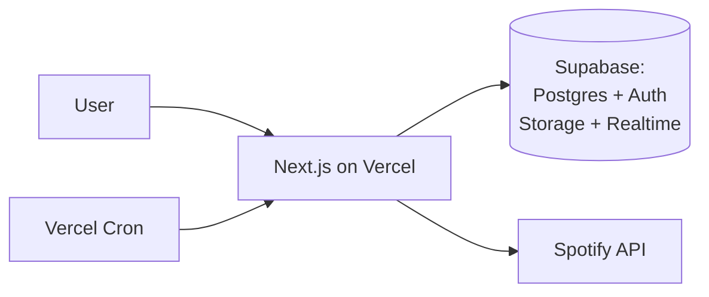

# Learn Our Favs — Lean Production PRD

**Author:** James Twisleton
**Version:** 0.1 (draft)
**Status:** This is the version intended to actually run.

---

## What this document is

This is the lean specification — the version I would actually build if the only goal were shipping something real that people use and that I can afford to keep online.

**The product is identical to the demonstration version.** It is specified in [`../docs/PRODUCT.md`](../docs/PRODUCT.md) at the repo root; read that first.

This document describes the lean *stack* and *implementation choices* — why certain decisions from the heavy version are dropped and what replaces them. It is shorter because the implementation is small. That is the point.

The previous deployment ran on Fly.io and was taken offline because it cost more than a hobby project justifies. Cost control is a first-class requirement here, not an afterthought.

---

## Stack

| Concern | Choice | Note |
|---|---|---|
| Framework | Next.js (App Router) | Frontend and API routes in one deployment |
| Hosting | Vercel | Preview deployments free and automatic |
| Database | Supabase (Postgres) | Managed, generous free tier, row-level security |
| Auth | Supabase Auth | Social providers built in |
| Object storage | Supabase Storage | Avatars and recordings |
| Realtime | Supabase Realtime | Collaborative notes |
| Background work | Vercel Cron + queue table | Media processing, catalogue ingestion |
| Search | Spotify's own search API | Proxied, not indexed |

One platform, one bill, one thing to reason about.

---

## What is kept from the heavy version

These are product and safety decisions, not infrastructure choices, so they survive intact:

- **Identities keyed on `(provider, provider_user_id)`**, never email. Email is mutable, sometimes absent, and attacker-controllable.
- **No auto-linking by email.** A second provider attaches only from an authenticated session. Without this, someone registers an account carrying a victim's email and is silently attached to their account.
- **Band roles resolved per request**, never baked into a token — enforced here by row-level security policies rather than application checks.
- **Band scope and platform scope kept separate.** A band owner is not a site administrator.
- **Learning state per (user, song, instrument).**
- **Overlap computed on read** — a Postgres view, re-evaluating when membership or threshold changes.
- **Slugs generated server-side** from a curated safe word list, unique constraint with retry.
- **Pre-join visibility limited** to band name, member count, and instruments.
- **Personal data out of queue payloads**, so erasure requests stay simple.

---

## What is dropped, and why

| Dropped | Replaced by | Reasoning |
|---|---|---|
| Kubernetes | Vercel | No orchestration problem exists at this size |
| Dual-cloud Terraform | Single platform | Portability is a cost, paid for a benefit nobody is asking for |
| Kafka | Postgres queue table | One genuinely async job — media processing |
| Spanner | Postgres | Planet-scale database, hobby-scale app |
| MongoDB | JSONB column | A second datastore for one feature is rarely worth it |
| OpenSearch | Spotify search API | The catalogue is already searchable upstream |
| Java Spring Boot backend | Next.js API routes | One language, one deployment, one runtime |
| Self-managed identity tokens | Supabase Auth | The linking *rules* matter; the infrastructure does not |
| Datadog | Vercel + Supabase built-ins | Adequate at this scale, and free |

---

## Cost control

The specific failure being designed against: an idle side project accruing charges.

- **Video recording is the main cost risk** — egress dominates, not storage. Ships audio-only at first, with a duration cap. Video only if people actually ask for it.
- **Spotify and YouTube responses cached** to stay inside free quotas. YouTube search costs 100 quota units per call against a 10,000/day allowance, so pasting a link stays the primary path.
- **Billing alerts** on both Vercel and Supabase.
- **Everything scales to zero** when nobody is using it.

⬥ *Target: under £10/month at low usage. To be validated against real figures before launch rather than assumed.*

---

## Data protection

Same obligations, less surface area.

UK GDPR sets no fixed retention period — periods are defined per data type, justified against purpose, and documented. Account deletion removes rows, storage objects, and queue entries. Because personal data never enters queue payloads, erasure stays a single transaction plus an object cleanup.

Sensitive items: Spotify refresh tokens (encrypted, revoked on unlink) and user recordings (deleted with the account).

---

## Migration path

The two versions share a schema shape deliberately, so the lean version is not a dead end:

1. Postgres schema is portable to RDS unchanged.
2. Identity model already provider-agnostic, so swapping auth providers touches one module.
3. The queue table can be replaced by a broker if load ever justifies it — the producer interface does not change.

Realistically this migration never happens, and that is fine. It exists so that "start simple" is not a decision that has to be unwound later.

---

## Open decisions ⬥

Resolved in lockstep with the demonstration version — see
`../cloud-agnostic/docs/adr/`. Summary as it applies here:

1. **Audio-only at launch, or video with a hard duration cap?** — Lean ships
   audio-only with a duration cap; video only on request. (The demonstration
   version runs uncapped with cost monitoring; that is the one deliberate
   divergence between the two.)
2. **YouTube in v1 at all?** — Link-paste only, no API search. [ADR 0010](../cloud-agnostic/docs/adr/0010-youtube-link-paste-only-v1.md).
3. **Difficulty — parked, or user-rated?** — User-rated. [ADR 0011](../cloud-agnostic/docs/adr/0011-user-rated-difficulty.md).
4. **Note authorship when a member leaves a band.** — Keep content, relabel the
   author "Former member". [ADR 0014](../cloud-agnostic/docs/adr/0014-note-authorship-on-member-departure.md).
5. **Log retention period.** — App logs 30 days; audit/security logs 90 days.
   [ADR 0015](../cloud-agnostic/docs/adr/0015-log-retention-periods.md).
